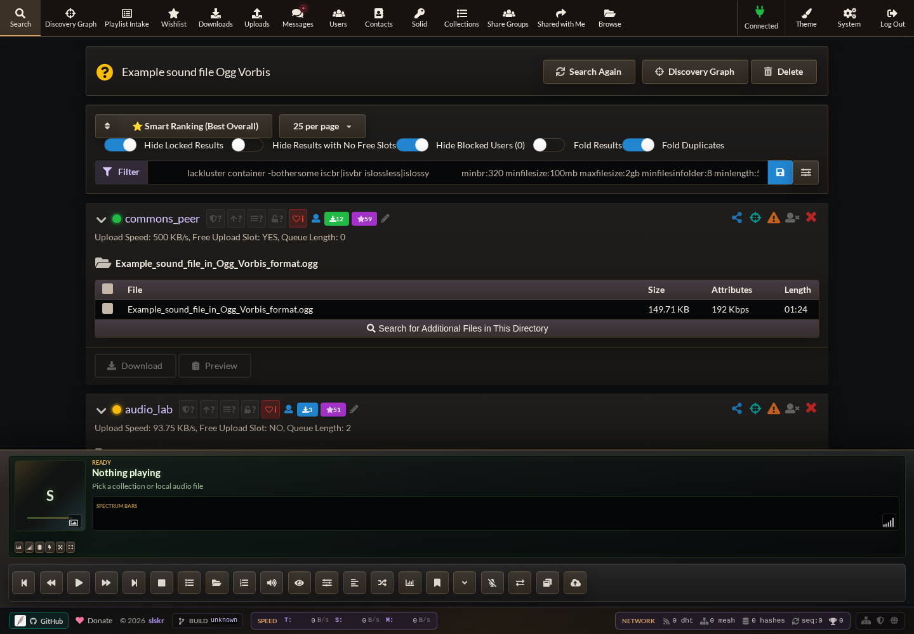
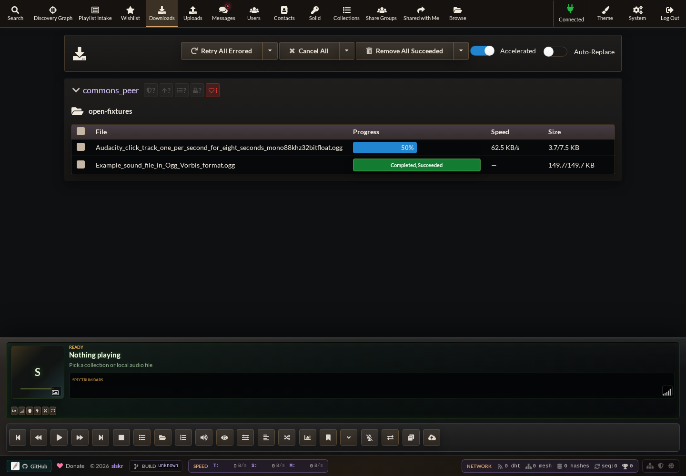
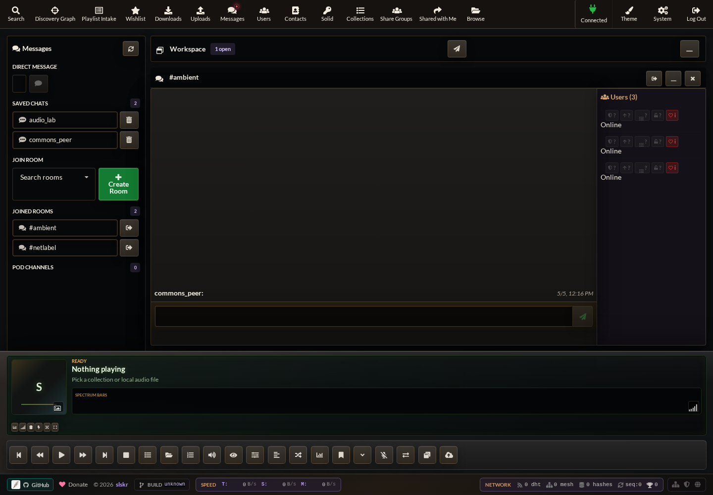
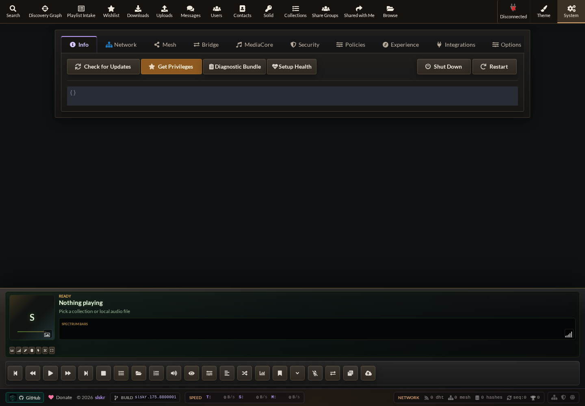

# slskr

[](https://discord.gg/hyG8Pf6KGA)

`slskr` is a self-hosted Rust daemon, HTTP API, and browser UI for the
[Soulseek](https://www.slsknet.org/news/) network.

It is built for operators who want a private, scriptable Soulseek client they
can run locally, on a server, or behind their own service boundary. One
`slskr serve` process owns the Soulseek session, peer listeners, share index,
transfer engine, API, event stream, and bundled Web UI.

## Project Status

`slskr` is the Rust implementation target for the slskr/slskdN feature-parity
work. The daemon already includes the main operating surfaces needed by a
browser client and API automation:

- Soulseek login/session management, keepalive, reconnect, and listener state.
- Search, browse, private messages, rooms, watched users, shares, and transfers.
- Direct, obfuscated, and indirect peer probes for protocol/runtime validation.
- Bundled Web UI plus compatibility-oriented HTTP endpoints and event streams.
- TypeScript, Python, Go, and Rust client surfaces for automation and tests.
- Release, security, packaging, live-interop, and public-posture gates.

The compatibility goal is behavioral and operational compatibility with useful
slskd/slskdN workflows, not a copied implementation. Advanced discovery,
metadata, integrations, and mesh/federation surfaces should be treated as
configuration-dependent or experimental unless the linked docs and tests say
otherwise.

## Table Of Contents

- [Screenshots](#screenshots)
- [Features](#features)
- [Quick Start](#quick-start)
- [Configuration](#configuration)
- [Security](#security)
- [HTTP API Examples](#http-api-examples)
- [CLI Reference](#cli-reference)
- [Testing And Verification](#testing-and-verification)
- [Certification And VPN Isolation](#certification-and-vpn-isolation)
- [Deployment](#deployment)
- [Repository Layout](#repository-layout)
- [Documentation Index](#documentation-index)
- [Support](#support)
- [License](#license)

## Screenshots

The README screenshots are generated from the local Web UI with mocked daemon
responses, so they do not contain credentials.

| Search and discovery | Transfers |
| --- | --- |
|  |  |

| Rooms and messaging | System status |
| --- | --- |
|  |  |

Regenerate screenshots from a running frontend with:

```bash
cd web
SLSKR_SCREENSHOT_BASE_URL=http://127.0.0.1:3001 \
  node scripts/capture-readme-screenshots.mjs
```

## Features

### Web Access

`slskr serve` starts the daemon and serves the Web UI on the same HTTP listener.
The default bind is loopback-only:

```text
http://127.0.0.1:5030/
```

The UI includes search, downloads, uploads, rooms, private messages, users,
contacts, browse state, shares, collections, integrations, player controls,
configuration status, telemetry, and runtime health.

### Search And Results

Search supports global, user, room, and wishlist-style targets. Results include
peer metadata such as locked state, slot availability, queue length, speed, file
size, and path. The UI adds filters, duplicate folding, hidden/blocked users,
search history, review notes, acquisition profiles, discovery graph panels, and
metadata-assisted follow-up searches.

### Transfers

Downloads and uploads are represented as daemon-owned transfer records with
queue, start, progress, completion, cancellation, retry, and failure state.
`slskr` supports local file-backed projections for tests, outbound downloads,
inbound shared-file serving, direct peer transfer sockets, type-1 obfuscated
transfer sockets, indirect transfer fallback, offset/resume fields, and bounded
transfer event history. Explicit accelerated downloads can use
`POST /api/v0/multisource/swarm` (or `/swarm/async`) with two or more HTTP
range-capable sources and an expected SHA-256 digest. The daemon dynamically
assigns bounded chunks across free sources, retries failed chunks elsewhere,
then verifies and atomically publishes the confined output. Ordinary Soulseek
peers use sequential transfer/failover because Soulseek does not support
harmless bounded range cancellation.

Short-lived peer and mesh preview tickets stream audio to the browser without
creating a normal download. Peer previews negotiate Soulseek directly and do
not write a local file. Mesh previews can redeem a hash-pinned HTTP range
source; bytes are exposed only after exact-size and SHA-256 verification, and
the confined staging file is removed immediately afterward.

### Shares And Browse

Share roots are indexed at startup or by rescan. The catalog uses virtual share
paths rather than exposing raw host paths. Operators can configure hidden-file
handling, symlink following, scan limits, and allowed transfer directions.
Browse state is tracked per peer and exposed through the API and Web UI.

### Messaging, Rooms, And Users

The daemon tracks private-message conversations, message acknowledgement, room
lists, room join/leave state, recent room messages, watched users, user stats,
contacts, notes, and related peer context needed by search and browse workflows.

### API And Automation

The HTTP API exposes versioned `/api/v0/*` routes plus selected unversioned
compatibility aliases. API clients can use bearer auth or the `X-API-Key` header
with the same token. Event consumers can poll bounded event records or subscribe
to the WebSocket event stream.

OpenAPI and detailed endpoint docs live in:

- [docs/http-api.md](./docs/http-api.md)
- [docs/http-api-features.md](./docs/http-api-features.md)
- [docs/openapi.json](./docs/openapi.json)
- [docs/CLIENT_LIBRARIES.md](./docs/CLIENT_LIBRARIES.md)

### Integrations

Current integration surfaces include Spotify OAuth callback handling on the
daemon HTTP listener, Lidarr status/wanted/manual-import flows, external
visualizer launch reporting, and UI-side panels for library, source, and
recommendation workflows. Integrations report unavailable or disabled states
when required local config or credentials are missing.

## Quick Start

### Download A Release

Release artifacts are published from tags named `release-v<semver>`:

```text
https://github.com/snapetech/slskr/releases
```

Archives include the `slskr` binary and bundled web assets for supported Linux,
macOS, and Windows targets, plus checksums and release manifests. Extract the
archive for your platform, put the binary on your `PATH`, then create a config.

### Build From Source

Prerequisites:

- Rust toolchain compatible with the workspace `rust-version`.
- Node.js/npm when working on or testing web assets.
- Soulseek credentials for real network operation.
- Optional Go and Python for client-library test gates.

Build and install locally with the React Web UI used in the screenshots:

```bash
npm --prefix web ci
npm --prefix web run build
cargo build --release -p slskr
install -Dm755 target/release/slskr "$HOME/.local/bin/slskr"
mkdir -p "$HOME/.local/share/slskr/web"
cp -R web/build "$HOME/.local/share/slskr/web/build"
```

`slskr serve` looks for the production UI in `SLSKR_WEB_BUILD_DIR`, next to the
binary as `web/build`, under `$prefix/share/slskr/web/build`, or in the current
repository checkout. `/` is the full React client when those assets are present.
The minimal built-in operator dashboard is available at `/dashboard`; if no
built UI is present, `/` falls back to that dashboard and explains how to install
the full UI.

Print version information:

```bash
slskr version
```

Run a login smoke test:

```bash
SLSK_USERNAME=<username> \
SLSK_PASSWORD=<password> \
slskr login smoke
```

Start the daemon and Web UI:

```bash
slskr serve
```

Then open:

```text
http://127.0.0.1:5030/
```

On first connect, the Web UI prompts for Soulseek credentials and lets you choose
runtime-only memory, the platform OS credential store, or a restricted local
credential file. Linux services can use read-only systemd credentials through
`LoadCredential=` or `LoadCredentialEncrypted=`. `SLSK_USERNAME`/`SLSK_PASSWORD`
and config-file credentials remain supported for container secret managers and
scripted deployments.

## Configuration

Start from the annotated example:

```text
docs/slskr.config.example.toml
```

Default config path:

```text
$XDG_CONFIG_HOME/slskr/config.toml
```

Fallback when `XDG_CONFIG_HOME` is unset:

```text
$HOME/.config/slskr/config.toml
```

Default state directory:

```text
$XDG_STATE_HOME/slskr
```

Fallback when `XDG_STATE_HOME` is unset:

```text
$HOME/.local/state/slskr
```

Use `SLSKR_CONFIG=/path/to/config.toml` and
`SLSKR_STATE_DIR=/path/to/state` to override those paths. Environment variables
override config-file values.

Common settings:

| Setting | Purpose |
| --- | --- |
| `SLSKR_HTTP_BIND` | HTTP listener, default `127.0.0.1:5030`. |
| `SLSKR_AUTO_CONNECT` | Connect at startup when credentials are configured or stored. |
| `SLSKR_CREDENTIAL_STORE` | Soulseek credential storage: `os`, `systemd`, `memory`, or `file`. |
| `SLSKR_CREDENTIAL_FILE` | Local credential-file fallback path; default is under `SLSKR_STATE_DIR`. |
| `SLSK_USERNAME`, `SLSK_PASSWORD` | Soulseek account credentials for env/config secret-manager deployments. |
| `SLSKR_API_TOKEN` | Token for protected API routes. |
| `SLSKR_SHARE_DIRS` | Semicolon-separated share roots. |
| `SLSKR_LISTENER_BIND` | Regular peer listener bind address. |
| `SLSKR_ADVERTISED_PORT` | Public regular peer port advertised to the network. |
| `SLSKR_OBFUSCATED_LISTENER_BIND` | Optional obfuscated peer listener bind address. |
| `SLSKR_OBFUSCATED_ADVERTISED_PORT` | Public obfuscated peer port. |
| `SLSK_OBFUSCATION_MODE` | Outbound dial posture: regular-first `compatibility` (default) or obfuscated-first `prefer`. |
| `SLSKR_TRANSFER_MAX_ACTIVE` | Maximum active transfers. |
| `SLSKR_TRANSFER_ALLOW_INBOUND` | Enable inbound shared-file serving. |
| `SLSKR_TRANSFER_ALLOW_OUTBOUND` | Enable outbound downloads. |
| `SLSKR_TRANSFER_AUTO_RETRY_ENABLED` | Automatically retry aged failed audio downloads; defaults to `true`. |
| `SLSKR_DOWNLOAD_COMPLETED_PATH_TEMPLATE` | Optional confined download layout using `{uploader}`, `{remote_folder}`, `{remote_parent}`, `{remote_filename}`, `{batch_id}`, `{request_name}`, and `{date}` tokens. |
| `SLSKR_PERSISTENCE_ENABLED` | Enable SQLite-backed persistence paths. |
| `SLSKR_LOG_LEVEL` | Runtime log threshold: `trace`, `debug`, `info`, `warn`, or `error`. |

The Web UI System -> Logs tab can inspect recent daemon logs and change the
runtime log level without a restart. `RUST_LOG` is still accepted as a familiar
alias, while `SLSKR_LOG_LEVEL` takes precedence.

See [docs/credential-storage.md](./docs/credential-storage.md) for credential
store tradeoffs and [docs/install.md](./docs/install.md) for service units,
state layout, container shape, and exposure rules.

## Security

Default behavior is intentionally conservative:

- HTTP binds to `127.0.0.1:5030` by default.
- Non-loopback HTTP binds require `SLSKR_API_TOKEN` unless auth is explicitly
  disabled with `SLSKR_AUTH_DISABLED=true`.
- Protected API routes accept `Authorization: Bearer <token>` or
  `X-API-Key: <token>`.
- Browser-origin mutating requests are checked with `Origin`/`Referer` to reduce
  CSRF exposure.
- Sanitized config responses do not return credentials.
- Share APIs return virtual paths rather than raw host paths.

Before exposing `slskr` beyond localhost, set an API token, keep auth enabled,
put it behind a reverse proxy you control, and make sure forwarded `Host`,
`Origin`, and `Referer` headers are preserved. Peer listener ports are separate
from the HTTP UI/API port and should match the advertised ports configured for
your NAT, VPN, or port-forwarding setup.

## HTTP API Examples

Create a search:

```bash
curl -H "Authorization: Bearer $SLSKR_API_TOKEN" \
  -H "Content-Type: application/json" \
  -d '{"query":"Example sound file Ogg Vorbis","target":"global"}' \
  http://127.0.0.1:5030/api/v0/searches
```

List transfer projections:

```bash
curl -H "Authorization: Bearer $SLSKR_API_TOKEN" \
  http://127.0.0.1:5030/api/v0/transfers
```

Stream events:

```bash
curl -H "Authorization: Bearer $SLSKR_API_TOKEN" \
  http://127.0.0.1:5030/api/v0/events
```

Run the slskd-style API automation smoke:

```bash
SLSKR_SLSKD_API_SMOKE_TOKEN=slskd-api-smoke-token \
  scripts/run-slskd-api-compat-smoke.sh
```

## CLI Reference

Common operator commands:

```bash
slskr serve
slskr version
slskr login smoke
slskr smoke local-peer
slskr soak live
slskr probe peer-address
slskr probe plain-peer
slskr probe browse-peer
slskr probe search-peer
slskr probe download-peer
slskr probe private-message
slskr probe room-message
slskr probe obfuscated-peer
slskr probe indirect-peer
slskr probe distributed-peer
slskr probe file-transfer-peer
slskr probe metadata-relogin
slskr probe negative-indirect
```

The probe commands are deliberately narrow. Use them to verify one network
behavior at a time before running broader live smoke or soak suites.

## Testing And Verification

Common local checks:

```bash
cargo fmt --all --check
cargo test --workspace
```

Web checks:

```bash
cd web
npm test
npm run build
```

Release/package checks:

```bash
scripts/check-release-package.sh
scripts/run-release-gate.sh
```

Local two-account peer smoke:

```bash
SLSKR_A_USERNAME=<user-a> \
SLSKR_A_PASSWORD=<pass-a> \
SLSKR_B_USERNAME=<user-b> \
SLSKR_B_PASSWORD=<pass-b> \
SLSKR_INDIRECT_HOST_OVERRIDE=127.0.0.1 \
cargo run -p slskr -- smoke local-peer
```

Live interop and soak scripts are under [scripts](./scripts). They use real
accounts and public-network behavior, so run them deliberately and provide
credentials through your normal local secret source.

## Certification And VPN Isolation

`slskr` ships with a full certification runner and per-account VPN isolation to
bypass Soulseek's per-IP rate limiting:

```bash
# Run all phases (auto-detects VPN configs)
scripts/run-certification.sh

# Run specific phases
scripts/run-certification.sh --phases A,B,H

# Machine-parseable JSON output
scripts/run-certification.sh --log-format json

# Dry-run to see the plan
scripts/run-certification.sh --dry-run
```

Each test account is routed through its own isolated Proton WireGuard namespace
so the Soulseek server sees different source IPs per login. The runner covers
7 phases across 36 test cases:

| Phase | Coverage | Tests |
| --- | --- | --- |
| **A: Foundation** | Login, peer-address, plain/obfuscated/indirect peer | 5 |
| **B: Transfers** | Download, upload, resume, rejection | 5 |
| **C: Social** | Private messages, rooms, wishlist, browse | 6 |
| **D: Distributed** | Distributed ping, branch, search forwarding | 4 |
| **E: NAT-PMP** | Port claim, renew, collision, obfuscated, soak | 5 |
| **G: Soak** | Server soak, listener soak, NAT-PMP soak | 3 |
| **H: Negative** | Wrong password, offline peer, failure modes | 8 |

VPN isolation uses 8 Proton WireGuard configs mapped 1:1 to test accounts. See
[docs/vpn-certification.md](./docs/vpn-certification.md) for architecture,
credential pool setup, and troubleshooting. The full test plan and pass criteria
are in [docs/full-network-test-plan.md](./docs/full-network-test-plan.md).

## Deployment

`slskr` is designed around one daemon process, one config file, one state
directory, and explicit operator-controlled secrets.

Deployment assets include:

- Systemd examples in [docs/install.md](./docs/install.md).
- Kubernetes manifests in [k8s](./k8s).
- Prometheus rules and ServiceMonitor examples in [k8s](./k8s).
- Public posture checks in [scripts/check-public-posture.sh](./scripts/check-public-posture.sh).
- Release packaging checks in [scripts/check-release-package.sh](./scripts/check-release-package.sh).

For container deployments, run the same command, `slskr serve`, mount config
read-only, mount state read-write, and expose only the HTTP and peer listener
ports you intend to publish.

## Repository Layout

```text
.
├── crates/
│   ├── slskr/            # daemon, API, web serving, config, storage, telemetry
│   ├── slskr-client/     # async session, peer, search, browse, transfer runtime
│   ├── slskr-protocol/   # protocol messages, codecs, frames, obfuscation
│   └── slskr-web/        # Rust/WASM web UI migration target
├── web/                  # React/Vite Web UI and screenshot/test harness
├── client-ts/            # TypeScript API client
├── client-python/        # Python API client
├── client-go/            # Go API client
├── docs/                 # API, install, feature, fixture, and release docs
├── examples/             # example workflows
├── fixtures/             # hash-pinned fixture manifests
├── k8s/                  # Kubernetes deployment and observability manifests
└── scripts/              # smoke, soak, posture, release, and fixture helpers
```

## Documentation Index

Start with the full documentation map in [docs/README.md](./docs/README.md).
The table below links the maintained entry points most users need first.

| Document | Purpose |
| --- | --- |
| [docs/README.md](./docs/README.md) | Full documentation index, status notes, and cross-links. |
| [docs/install.md](./docs/install.md) | Build, install, config/state, service, container, and exposure runbook. |
| [docs/app-surface.md](./docs/app-surface.md) | User-facing app surface and compatibility map. |
| [web/README.md](./web/README.md) | React Web UI development, audit, build, and screenshot workflow. |
| [docs/http-api.md](./docs/http-api.md) | HTTP API reference. |
| [docs/http-api-deployment.md](./docs/http-api-deployment.md) | Deployment notes for the HTTP listener, auth, reverse proxies, and Kubernetes. |
| [docs/http-api-features.md](./docs/http-api-features.md) | HTTP API capability notes and workflow examples. |
| [docs/openapi.json](./docs/openapi.json) | OpenAPI document. |
| [docs/WEBHOOK_API.md](./docs/WEBHOOK_API.md) | Webhook API and delivery model. |
| [docs/CLIENT_LIBRARIES.md](./docs/CLIENT_LIBRARIES.md) | TypeScript, Python, Go, and Rust client notes. |
| [client-ts/README.md](./client-ts/README.md) | TypeScript/JavaScript client package usage. |
| [client-python/README.md](./client-python/README.md) | Python client package usage. |
| [client-go/README.md](./client-go/README.md) | Go client package usage. |
| [examples/README.md](./examples/README.md) | API and automation examples. |
| [docs/live-interop-test-matrix.md](./docs/live-interop-test-matrix.md) | Live network and cross-client verification matrix. |
| [docs/vpn-certification.md](./docs/vpn-certification.md) | Per-account VPN isolation, credential pool setup, and certification runner. |
| [docs/full-network-test-plan.md](./docs/full-network-test-plan.md) | Full network test phases, pass criteria, and certification plan. |
| [docs/open-commons-fixtures.md](./docs/open-commons-fixtures.md) | Open fixture policy and source list. |
| [docs/release.md](./docs/release.md) | Release tag, archive, and metadata policy. |
| [COMPLIANCE.md](./COMPLIANCE.md) | Public posture, licensing, and project compliance notes. |
| [docs/slskr.config.example.toml](./docs/slskr.config.example.toml) | Annotated config example. |

Canonical repository:

```text
https://github.com/snapetech/slskr
```

## Support

Community support and migration discussion can be found on Discord:
[discord.gg/hyG8Pf6KGA](https://discord.gg/hyG8Pf6KGA).

## License

`slskr` is licensed under AGPL-3.0-only. See [LICENSE](./LICENSE) and
[NOTICE](./NOTICE).
