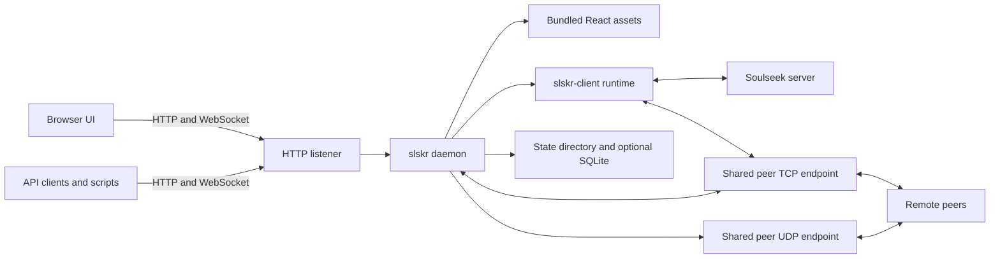

# slskR Architecture And Network Layout

slskR is a Rust daemon with one application process. The process owns the
Soulseek session, peer networking, share index, transfer lifecycle, HTTP API,
event feed, runtime state, and optional integrations. The released browser UI
is a bundled React application served by the daemon.

## Main components

The `slskr-client` crate owns protocol and session behavior; the application
crate owns the HTTP surface, configuration, storage projections, and hosted
Web UI. The TypeScript, Python, and Go clients use the HTTP contract rather
than connecting directly to Soulseek. The Rust client crate is also used by
the application and protocol tests.

## Network listeners

The HTTP listener serves the Web UI, API, WebSocket event feed, and Spotify
OAuth callback. It defaults to `127.0.0.1:5030` and is kept separate from the
peer-facing Soulseek port.

In the native/current profile, peer traffic is consolidated:

- Ordinary Soulseek peer messages, file transfers, type-1 obfuscation, and
  mesh TLS use the peer TCP listener.
- Mainline DHT, mesh control, and QUIC use UDP on the same numeric port.
- The default peer port is 50300. A custom peer port is projected across these
  peer services.
- These are TCP and UDP transports using the same port number. They do not
  require separate public port numbers for each peer service.

The HTTP listener is still a distinct application port. For a typical remote
peer deployment, forward the peer port number for both TCP and UDP; expose the
HTTP listener only to the networks that need the UI or API. If remote browser
access is required, use an authenticated reverse proxy and preserve the
forwarded host and origin headers. See
[HTTP deployment](http-api-deployment.md).

The default shared layout applies to native/current operation. Frozen
compatibility profiles can retain historical behavior for differential tests.
Native/current mode rejects a separate obfuscation or overlay endpoint that
would add another peer port.

## State ownership

The configured state directory holds private runtime data such as credentials
when file storage is selected, messages, transfer state, share indexes,
SQLite data when enabled, and durable mesh identity. On Unix, slskR rejects a
symlinked state directory and restricts its permissions.

SQLite write-through and hydration are optional and disabled by default.
Subsystem-specific bounded state files remain in use where documented. The
[configuration guide](configuration.md) and [install runbook](install.md)
cover paths, credentials, persistence, and service permissions.

## Request and event flow

Browser and automation requests enter through the HTTP listener and use the
same API authorization and route behavior. The UI keeps its API token in the
browser session; automation clients can use bearer or API-key headers.

Runtime changes and network events update daemon-owned projections. Clients
can read bounded event records over HTTP or subscribe to the WebSocket event
feed. The [API reference](http-api.md) and
[client library guide](CLIENT_LIBRARIES.md) define the external contracts.

## Source layout

| Path | Responsibility |
| --- | --- |
| `crates/slskr` | Daemon command, configuration, hosted API/UI, storage, and telemetry. |
| `crates/slskr-client` | Soulseek session, peer connections, search, browse, transfers, and mesh client runtime. |
| `crates/slskr-protocol` | Wire messages, frame codecs, and protocol types. |
| `web` | Shipped React/Vite Web UI and browser test harness. |
| `client-ts`, `client-python`, `client-go` | API client libraries for automation. |
| `docs`, `scripts`, `k8s`, `packaging` | Operator guidance, verification, and deployment artifacts. |
